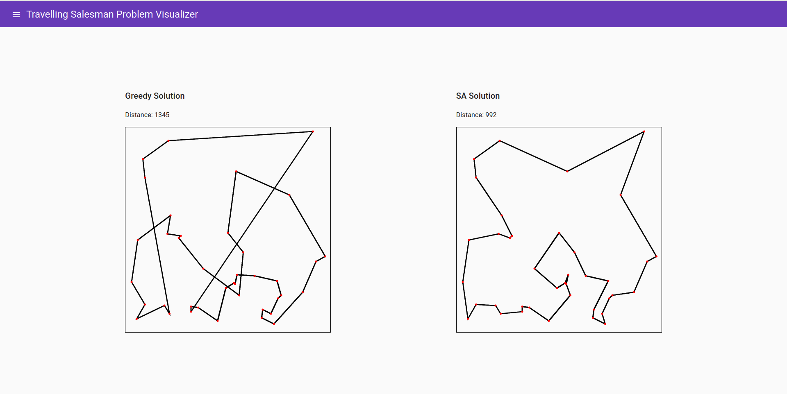
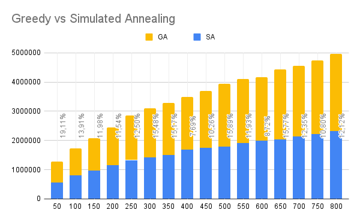
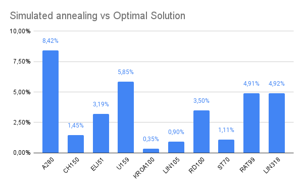

# Traveling Salesman Problem

[](https://github.com/RocketSteve/travelling-salesman-problem/actions/workflows/cmake.yml)
[](https://github.com/RocketSteve/travelling-salesman-problem/actions/workflows/codeql.yml)  \
This is a simple implementation of
the [traveling salesman problem](https://en.wikipedia.org/wiki/Travelling_salesman_problem) using
a [simulated annealing](https://en.wikipedia.org/wiki/Simulated_annealing) algorithm. <br>
This app is available as a cmd line app and a web app. <br>

## Simulated Annealing Algorithm

pseudo code:

```pseudo
1. Solution with greedy algorithm
2. temperature = max_temperature
3. while temperature > stop_temperature:
    a. Swap two random vertices
    b. Calculate the distance of the new solution
    c. if new_distance > best_distance
   	 i. best_solution = new_solution
    d. or if is_sensible_solution(new_distance)
   	 i. current_solution = new_solution
    e. decrease temperature
4. function is_sensible_solution(new_distance)
    a. random_number = random number from 0 to 1
    b. prob = e^(-(new_distance - current_distance)/temperature)
    c. return (prob < random_number)
```

## CMD Line App

Command Line app is available at branch `tsp-cmd-line-app`

### Usage

Usage minimal:

```shell 
./main instanceFilename
```

Usage with sa parameters:

```shell
./main instanceFilename stoppingTemperature stoppingIteration alpha
```

Example of usage:

```shell
./main ../instances/berlin52.tsp 0.0001 1000 0.999
.main ../instances/berlin52.tsp
```

## Web App

Web app is available at branch `main`
The goal of web app is visualizing the algorithm diffrenties between greedy algorithm and simulated annealing
algorithm. <br>


## Effectiveness

### Greedy vs Simulated Annealing

Differences between greedy algorithm and simulated annealing algorithm based on 20 instances with different size. <br>


### Optimal vs Simulated Annealing

Differences between optimal solution and simulated annealing algorithm based on 15 instances with known optimal
solution. <br>


### TSP Problem Instances Library

[Library](http://comopt.ifi.uni-heidelberg.de/software/TSPLIB95/)

## Instance

Instance syntax:

```txt
number_of_vertices
x_coordinate y_coordinate
```

Example of instance:

```txt
3
1 1
2 2
3 3

```

## Stack

- c++
- cmake
- websocketpp
- asio
- catch2
- angular
- typescript
- angular material
- canvas

## License

GNU General Public License v3.0
